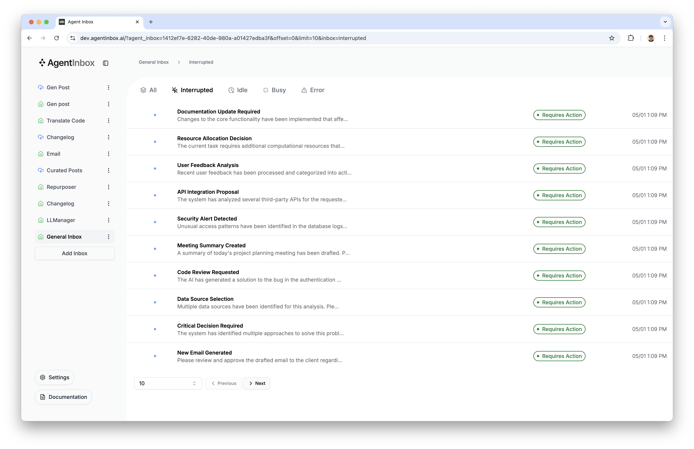

# Agent Inbox



> [!NOTE]
> Want to use the Agent Inbox without deploying it yourself? Check out the hosted version here: [dev.agentinbox.ai](https://dev.agentinbox.ai/)

## Prerequisites

Before getting started, ensure you have:
- Node.js, and yarn installed
- A LangGraph deployment set up and running (locally, or in production through LangGraph Platform)
- Your LangGraph API key

## Setup

> [!NOTE]
> 🎥 Prefer a video walkthrough? Checkout [this video](https://youtu.be/gF341XMN8cY) for a step-by-step guide.

> [!TIP]
> You can also view a minimum working version of a LangGraph agent using the Agent Inbox in [Python here](https://github.com/langchain-ai/agent-inbox-langgraph-example), and [TypeScript here](https://github.com/langchain-ai/agent-inbox-langgraphjs-example).


To start running the Agent Inbox, first clone the repository and install dependencies:

```bash
git clone https://github.com/langchain-ai/agent-inbox.git
cd agent-inbox
yarn install
```

## Configuration

Once up and running, you'll need to take two actions so that the Agent Inbox can connect to your LangGraph deployment.

1. Add your LangSmith API key: Click the "Settings" button in the sidebar, and enter your LangSmith API key.

2. Create your first inbox by opening the settings popover (bottom left, inside the sidebar), and clicking "Add Inbox". This will open a dialog with three fields:
  > - **Assistant/Graph ID**: (required) The name of your LangGraph graph, or an assistant ID. This will be used when sending human responses to your graph.
  > - **Deployment URL**: (required) The URL of your LangGraph deployment. This is how the Agent Inbox will connect to your LangGraph deployment for fetching interrupts, and sending human responses.
  > - **Name**: (optional) A name for your inbox. This will be used as a label for the inbox.

These values are stored in your browser's local storage, and are only used to connect & authenticate requests to the LangGraph deployment.

## Interrupts

In order to use the Agent Inbox with your LangGraph project, you'll need to update all instances of where interrupts are used in your codebase (where you want them to be compatible with the Agent Inbox).

Below, you'll find the interrupt input & output schemas for both Python and TypeScript.

<details>
<summary>Python Interrupt Schema</summary>

```python
class HumanInterruptConfig(TypedDict):
    allow_ignore: bool
    allow_respond: bool
    allow_edit: bool
    allow_accept: bool


class ActionRequest(TypedDict):
    action: str
    args: dict

class HumanInterrupt(TypedDict):
    action_request: ActionRequest
    config: HumanInterruptConfig
    description: Optional[str]


class HumanResponse(TypedDict):
    type: Literal['accept', 'ignore', 'response', 'edit']
    args: Union[None, str, ActionRequest]
```
</details>

<details>
<summary>TypeScript Interrupt Schema</summary>

```typescript
export interface HumanInterruptConfig {
  allow_ignore: boolean;
  allow_respond: boolean;
  allow_edit: boolean;
  allow_accept: boolean;
}

export interface ActionRequest {
  action: string;
  args: Record<string, any>;
}

export interface HumanInterrupt {
  action_request: ActionRequest;
  config: HumanInterruptConfig;
  description?: string;
}

export type HumanResponse = {
  type: "accept" | "ignore" | "response" | "edit";
  args: null | string | ActionRequest;
};
```
</details>

### Schema Usage

The human interrupt schema is used to define the types of interrupts, and what actions can be taken in response to each interrupt. We've landed on four types of actions:

- `accept`: Accept the interrupt's arguments, or action. Will send an `ActionRequest` in the `args` field on `HumanResponse`. This `ActionRequest` will be the exact same as the `action_request` field on `HumanInterrupt`, but with all keys of the `args` field on `ActionRequest` converted to strings.
- `edit`: Edit the interrupt's arguments. Sends an instance of `ActionRequest` in the `args` field on `HumanResponse`. The `args` field on `ActionRequest` will have the same structure as the `args` field on `HumanInterrupt`, but the values of the keys will be strings, and will contain any edits the user has made.
- `response`: Send a response to the interrupt. Does not require any arguments. Will always send back a single string in the `args` field on `HumanResponse`.
- `ignore`: Ignore the interrupt's arguments, or action. Returns `null` for the `args` field on `HumanResponse`.

You can set any combination of these actions in the `config` field on `HumanInterrupt`.

When the Agent Inbox sends a response, it will always send back a list with a single `HumanResponse` object in it.

#### What do the fields mean?

- `action_request`: The action and arguments for the interrupt
  - `action`: The name, or title of the action. This is rendered in the Agent Inbox as the main header for the interrupt event.
  - `args`: The arguments for the action. E.g tool call arguments.
- `config`: The configuration for the interrupt
  - `allow_ignore`: Whether the user can ignore the interrupt
  - `allow_respond`: Whether the user can respond to the interrupt
  - `allow_edit`: Whether the user can edit the interrupt
  - `allow_accept`: Whether the user can accept the interrupt
- `description`: A description of the interrupt
  - Should be detailed, and may be markdown. This will be rendered in the Agent Inbox as the description, and is commonly used to include additional context about the interrupt, and/or instructions on how to respond to the interrupt.

### How to use

To use the Agent Inbox, you'll have to use the `interrupt` function, instead of raising a `NodeInterrupt` exception in your codebase. To read more about how the `interrupt` function works, see the LangGraph documentation: [conceptual guide](https://langchain-ai.github.io/langgraph/concepts/human_in_the_loop/#interrupt) [how-to guide](https://langchain-ai.github.io/langgraph/how-tos/human_in_the_loop/wait-user-input/) (TypeScript docs coming soon, but the concepts & implementation are the same).

Then, when calling the `interrupt` function, you should pass an instance of `HumanInterrupt` as the `interrupt` argument. Then, when the user sends a response to the interrupt, you should expect the return value of the `interrupt` function to be an instance of `HumanResponse`.

### Examples

Here's a simple example of using the interrupt function in your LangGraph project:

<details>
<summary>Python Example Usage</summary>

```python
from typing import TypedDict, Literal, Optional, Union
from langgraph.types import interrupt

def my_graph_function(state: MyGraphState):
    # Extract the last tool call from the `messages` field in the state
    tool_call = state["messages"][-1].tool_calls[0]
    # Create an interrupt
    request: HumanInterrupt = {
        "action_request": {
            "action": tool_call['name'],
            "args": tool_call['args']
        },
        "config": {
            "allow_ignore": True,
            "allow_respond": True,
            "allow_edit": False,
            "allow_accept": False
        },
        "description": _generate_email_markdown(state) # Generate a detailed markdown description.
    }
    # Send the interrupt request, and extract the first response.
    # The Agent Inbox will always respond with a list of `HumanResponse` objects, although
    # at this time only a single object will be returned.
    response = interrupt(request)[0]
    if response['type'] == "response":
        # Do something with the response
    
    # ...rest of function
```

</details>

<details>
<summary>TypeScript Example Usage</summary>

```typescript
import { interrupt } from "@langchain/langgraph";
import { HumanInterrupt, HumanResponse } from "@langchain/langgraph/prebuilt";

function myGraphFunction(state: MyGraphState) {
  // Extract the last tool call from the `messages` field in the state
  const toolCall = state.messages[state.messages.length - 1].tool_calls[0];
  // Create an interrupt
  const request: HumanInterrupt = {
    action_request: {
      action: toolCall.name,
      args: toolCall.args
    },
    config: {
      allow_ignore: true,
      allow_respond: true,
      allow_edit: false,
      allow_accept: false
    },
    description: _generateEmailMarkdown(state) // Generate a detailed markdown description.
  };
  // Send the interrupt request, and extract the first response.
  // The Agent Inbox will always respond with an array of `HumanResponse` objects, although
  // at this time only a single object will be returned.
  const response = interrupt<HumanInterrupt, HumanResponse[]>(request)[0];
  if (response.type === "response") {
    // Do something with the response
  }
  // ...rest of function
};

```

</details>

## Troubleshooting

Common issues and solutions:

### Connection Issues
 - Verify your `LANGSMITH_API_KEY` is set correctly
 - Ensure your Deployment URL is accessible
 - Check if your LangGraph deployment is running

### Schema Validation Errors
 - Ensure all required fields are present in your interrupt objects
 - Verify the types of all fields match the schema
 - Check that response handling matches expected types
 - Check you're extracting the first object from the response list returned by the `interrupt` function

### The Open in Studio button doesn't work for my deployed graphs
 - This feature requires fields from your LangGraph deployment only made available after **04/18/2025**. If your graph *has not* created a new revision since then, you will need to create a new revision for this feature to work.
 - Delete the inbox, and re-add it. The logic for capturing the required fields to construct the Studio URL is new, and your inbox will need to be re-added for this feature to work.
